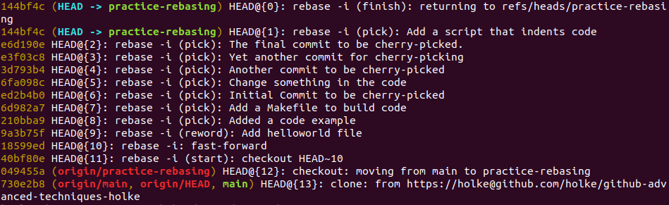

# git reflog

As we learn in the exercise on [interactive rebase](../rebase/README.md), we can
basically manipulate our complete history.
But what, if we mess up? For example if we delete the wrong commit? 

First of all: Don't panic.

`git reflog` is our savior. Git never forgets and stores a complete history of the local repository states, including lost commits.
 
With the command
```bash
git reflog
```
we get a log of all of our actions back to the very first commit.
Here is a screenshot of `git reflog` on the `practice-rebase` branch, right after we performed the first part of the rebasing exercise:



Since in this local copy of the repo, we did nothing else than checking out the `practice-rebase` branch and rebasing it, the reflog is rather short.
It starts at the bottom with the clone command. The second line from the bottom shows that we switched the branch.
From the third line from the bottom to the top we see the rebase action - starting with `rebase -i (start)` to `rebase -i (finish)`.

We see that in order to get back to the state right before the interactive rebase, we can simply checkout the SHA `049455a` of the status when we switched
the branches.

```bash
git checkout 049455a
```

This will set the local repository back and in a `detached HEAD` state. To get out of this state, we could create a branch.
```bash
git checkout -b new-branch-at-state-before-rebase
```


### The exercise

In this exercise we want to simulate that you messed up during interactive rebasing.
If you are not familiar with interactive rebasing, do the [interactive rebase](../rebase/README.md) exercise first.

Checkout the branch `practice-reflog`.
In the history of this branch, we find these two commits:
 
 6586d11ed - VERY IMPORTANT COMMIT

 88d249c39 - Accidentally commit secret files...not again!


1. Use `git rebase -i` to look at the last commits.
2. Instead of removing commit 88d249c39, 'accidentally' remove commit 6586d11ed. Oh no, you accidentally deleted a VERY IMPORTANT COMMIT!
3. Use `git reflog` to checkout the state before you rebased.
4. Make a new branch here, ensure that everything is correct and delete the old `practice-reflog` branch.
5. Rename the new branch to `practice-reflog`.
6. Do the interactive rebase again, but this time delete the correct commit.
